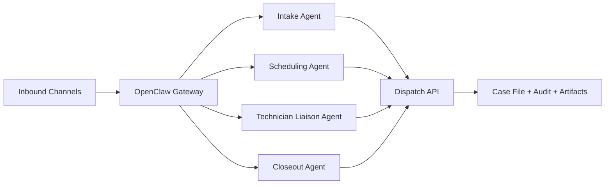

# Real Dispatch

Real Dispatch is an operations product, not a general assistant.

## Direction lock-in

- OpenClaw is the control plane.
- Real Dispatch owns the case file and all business state.
- State mutations are allowed only through a closed dispatch toolset.

## Canonical lifecycle

`new -> triaged -> schedulable -> scheduled -> dispatched -> onsite -> closeout_pending -> closed`

## Architecture split

- **Control plane (OpenClaw):** channels, routing, sessions, scheduler, runtime.
- **Data plane (Real Dispatch):** ticket state, evidence, closeout artifacts, invoice drafts, audit events.

## Start here

<Columns>
  <Card title="Getting started" href="/start/getting-started" icon="rocket">
    Bring up local control-plane runtime and validate dispatch boundaries.
  </Card>
  <Card title="Dispatch setup guide" href="/start/openclaw" icon="route">
    Configure lifecycle policy, role boundaries, and closed dispatch actions.
  </Card>
  <Card title="Contract RFC" href="/rfcs/0001-dispatch-core-contracts-v0" icon="file-check-2">
    Implement against the canonical state machine and tool contracts.
  </Card>
</Columns>

## Team handoff pack (v1)

- [Dispatch PRD v1](/concepts/dispatch-prd-v1)
- [RFC 0002 Dispatch Operating Model v1](/rfcs/0002-dispatch-operating-model-v1)
- [Work Order Workflow Spec v1](/reference/work-order-workflow-spec-v1)
- [Dispatch Event Schema v1](/reference/dispatch-event-schema-v1)
- [Dispatch SOP Library v1](/reference/dispatch-sop-library-v1)
